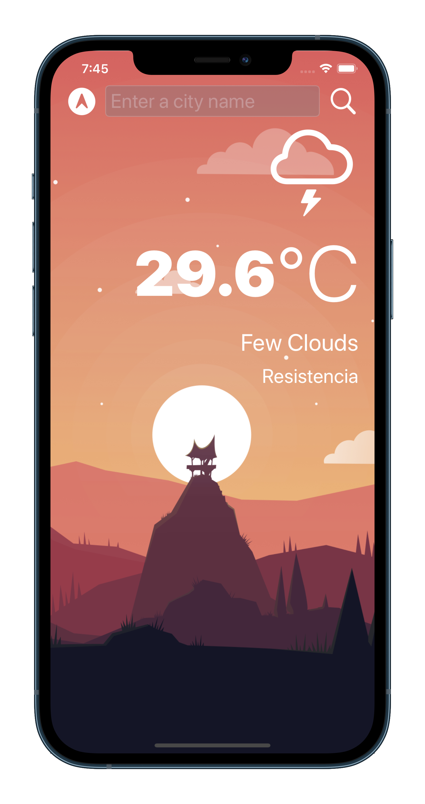
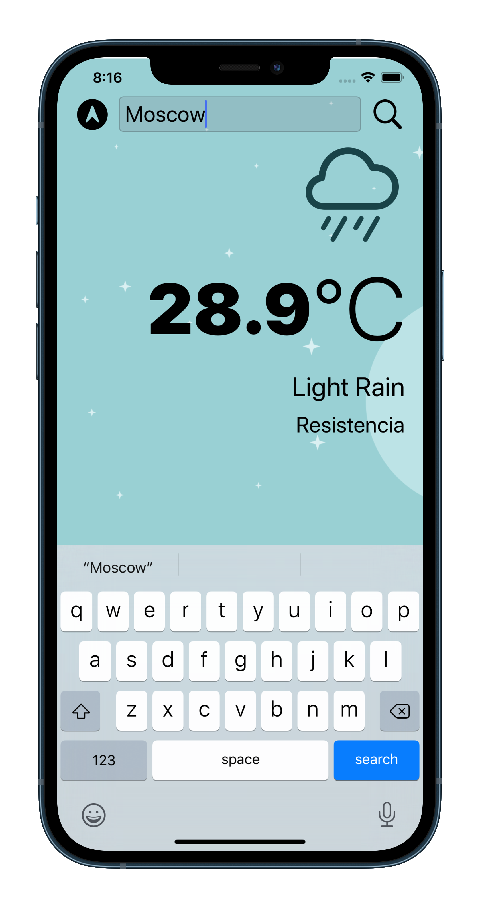
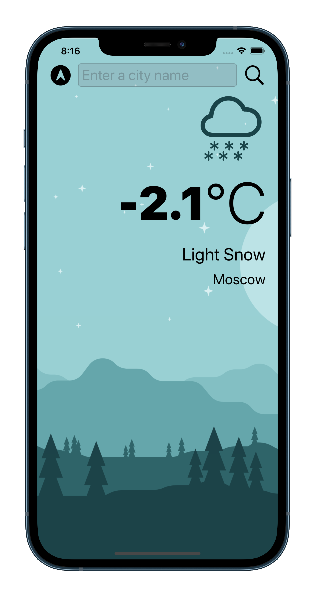
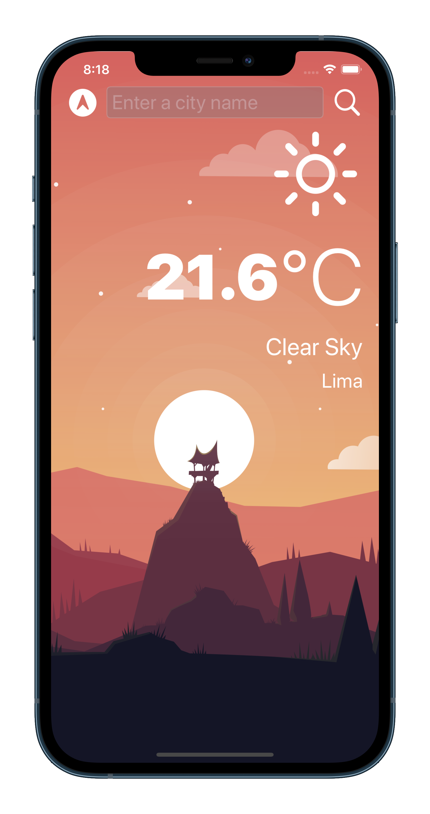

# Clima-iOS-App

Clima app made for iOS13 using Swift during iOS Develoment Bootcamp by AppBrewery

#  Clima

## Description

This application shows you the weather of your current location based on the GPS data from iPhone using  OpenWeatherMap API to grab live data from the internet. It also allows you to search the weather of a city manually. 

## Skills learned making this app

* Make light and dark mode compatible apps.
* Delegate pattern (used for UITextField and CoreLocation)
* Swift protocols and extensions.
* Swift guard keyword. 
* Swift computed properties.
* Swift closures and completion handlers.
* URLSession to network and make HTTP requests.
* JSON parsing with the native Encodable and Decodable protocols.
* Grand Central Dispatch (used for update UI)
* Core Location to get the current location from the phone GPS.

## Screenshots

    
    
    
    

